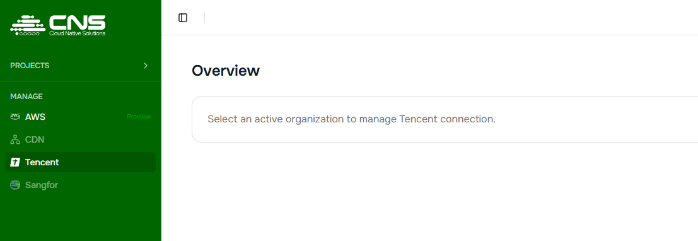
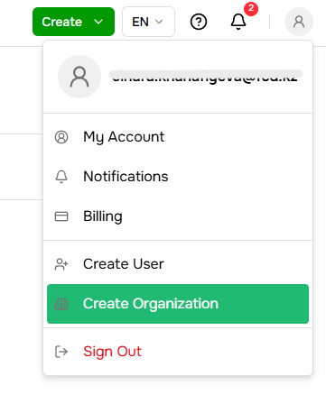
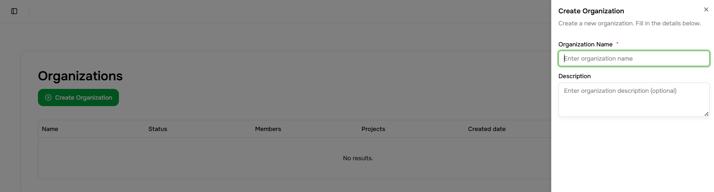
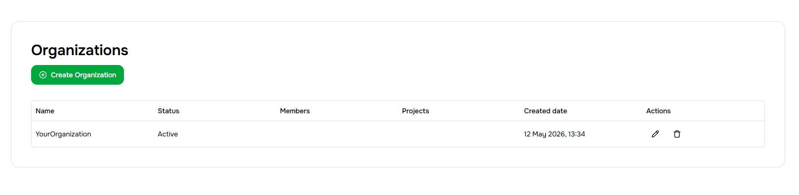
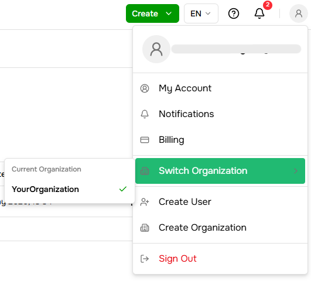
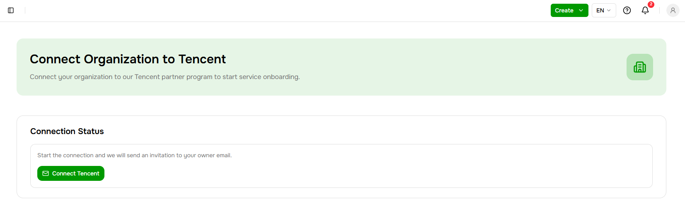
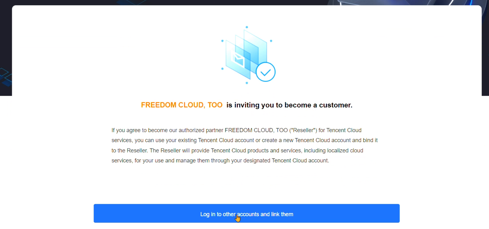
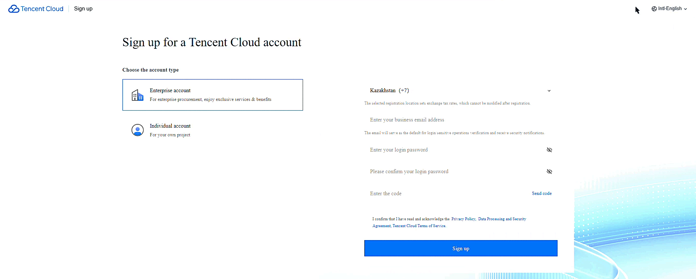
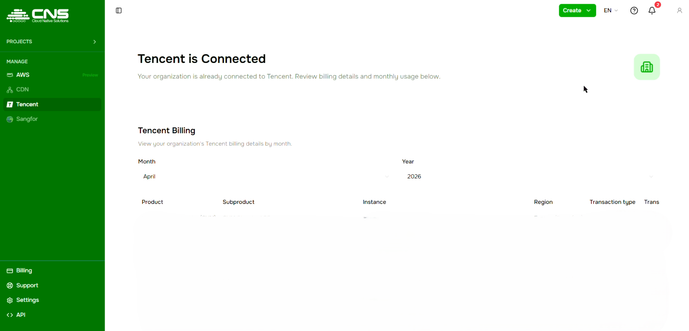

# Connecting to Tencent

Follow the steps below to start using Tencent Cloud services through the CNS platform.

---

## Step 1 - Create an organization

> If you already have an organization, skip to Step 2.

An organization is your company's workspace on the platform. Tencent connection is not available without one.

Click the account icon in the top-right corner and select **Create organization**, or select an existing organization you want to connect the service to.

In the panel that opens, fill in the **Organization name** field and click **Create organization**.

The organization will appear in the list with the status **Active**.

> Make sure the correct organization is selected in the account icon menu in the top-right corner.

---

## Step 2 - Start the Tencent connection

Go to the **Tencent** section in the left menu (under **Manage**) and click **Connect Tencent**.

The status will change to **Invitation sent** - an email from Tencent Cloud has been sent to the organization owner's email address.

---

## Step 3 - Accept the Tencent Cloud invitation

Open the email from **Tencent Cloud**.

The email contains a link in the format: `https://mc.tencentcloud.com/web/customer-invitation?...`

Follow the link. You will see a page inviting you to become a customer of the partner program.

---

## Step 4 - Register a Tencent Cloud account

Click **Log in to other accounts and link them** if you already have a Tencent Cloud account, or complete the registration form:

1. Choose your account type: **Enterprise account** (for companies) or **Individual account** (for personal use)
2. Enter your **country**, **email address**, and set a **password**
3. Enter the **verification code** sent to your email
4. Complete the image verification
5. Click **Sign up**

After registration, Tencent will verify your identity - please wait for this to complete.

---

## Done

Once all steps are complete, return to the **Tencent** section in the CNS console. The page will show the status **Tencent is Connected** along with your billing details.

---

> **Need help?** Submit a ticket in the [Support](https://console.cloud-native.kz/support) section or email us at [cns-support@fcd.kz](mailto:cns-support@fcd.kz).
