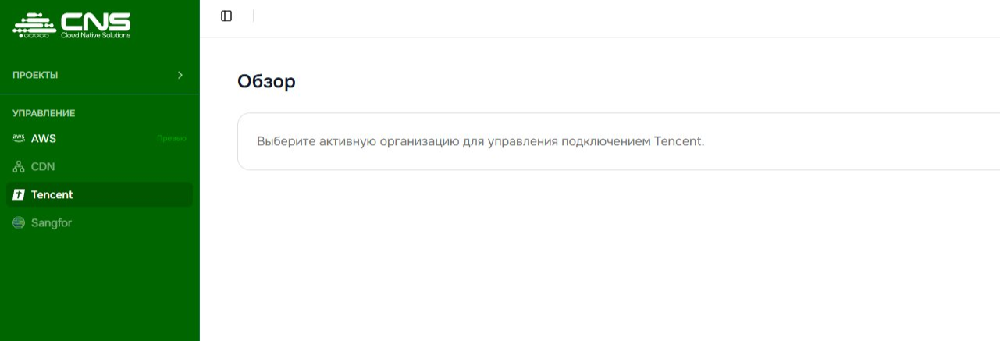
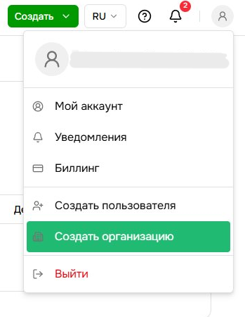
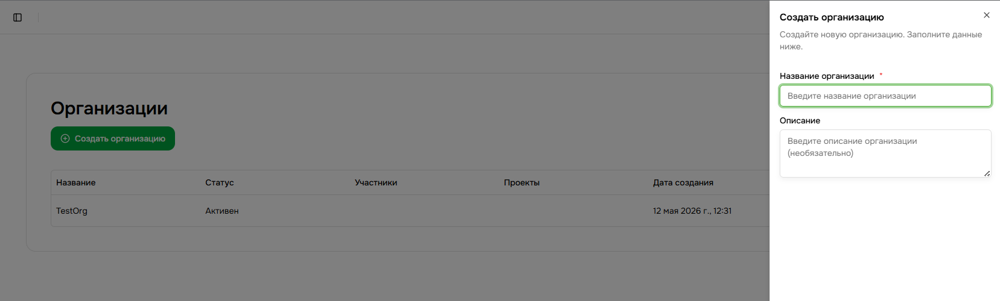
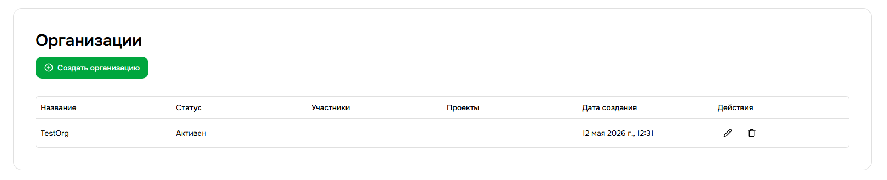
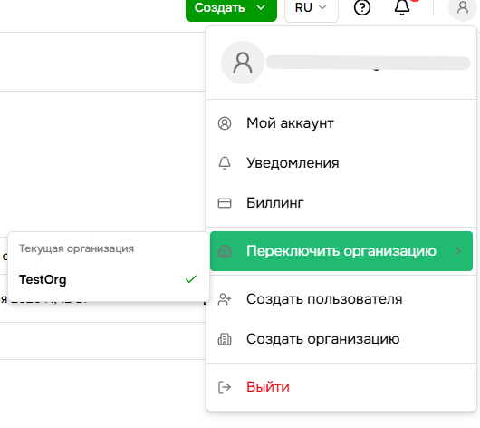
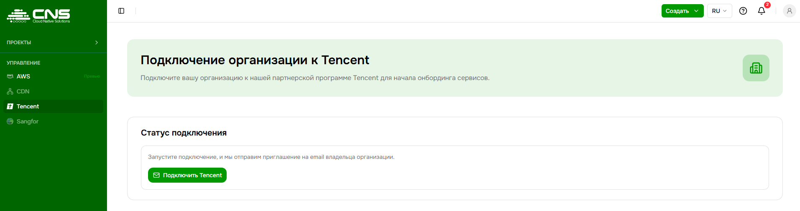
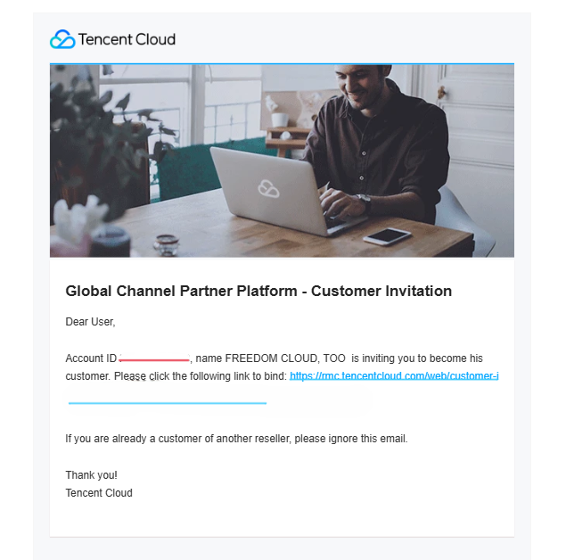

# Подключение к Tencent

Чтобы начать пользоваться сервисами Tencent через платформу CNS, выполните следующие шаги.

---

## Шаг 1 - Создайте организацию

> Если организация у вас уже есть - переходите сразу к Шагу 2.

Организация - это рабочее пространство вашей компании на платформе. Без неё подключение к Tencent недоступно.

Нажмите на иконку аккаунта в правом верхнем углу и выберите **Создать организацию** или выберите организацию, к которой хотите привязать сервис.

В открывшейся панели заполните поле **Название организации** и нажмите **Создать организацию**.

Организация появится в списке со статусом **Активен**.

> Убедитесь, что нужная организация выбрана вами в меню иконки аккаунта в правом верхнем углу.

---

## Шаг 2 - Запустите подключение к Tencent

Перейдите в раздел **Tencent** в левом меню (под заголовком **Управление**) и нажмите кнопку **Подключить Tencent**.

Статус изменится на **Приглашение отправлено** - на email владельца организации было отправлено письмо от Tencent Cloud.

---

## Шаг 3 - Примите приглашение от Tencent Cloud

Откройте письмо от **Tencent Cloud**.

В письме будет ссылка вида: `https://mc.tencentcloud.com/web/customer-invitation?...`

Перейдите по ней. Вы увидите страницу с предложением стать клиентом партнёрской программы.

---

## Шаг 4 - Зарегистрируйтесь в Tencent Cloud

Нажмите **Log in to other accounts and link them**, если у вас уже есть аккаунт Tencent Cloud, или заполните форму регистрации:

1. Выберите тип аккаунта: **Enterprise account** (для компаний) или **Individual account** (для личного использования)
2. Укажите **страну**, **email** и задайте **пароль**
3. Введите **код подтверждения**, отправленный на email
4. Пройдите проверку изображением
5. Нажмите **Sign up**

После регистрации Tencent проведёт верификацию личности - дождитесь её завершения.

---

## Готово

После успешного прохождения всех шагов вернитесь в раздел **Tencent** в консоли CNS. Страница отобразит статус **Tencent is Connected** и биллинговую информацию по вашим ресурсам.

---

> **Нужна помощь?** Создайте тикет в разделе [Поддержка](https://console.cloud-native.kz/support) или напишите на [cns-support@fcd.kz](mailto:cns-support@fcd.kz).
